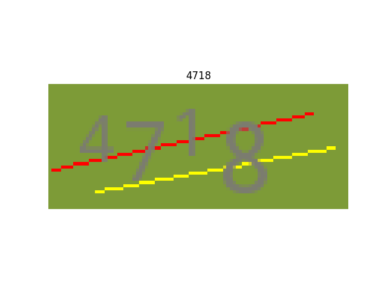
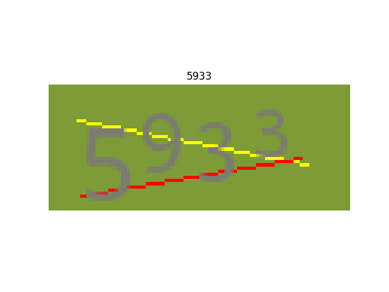

# An YOLO like verification code recognization network.
 

### this is a very simple network to recognize the captcha verification code.
  it is used to demonstrate the power of convolution network. instead of classification, the convnet has the abilities to detect the object size, location, orientation,color, etc as shown by R-CNNs and YOLO. the final classification is just a combination of above factors I believe. faster R-CNN and YOLO are used to detect the object calss and also their locations. but for verification code recognization, bounding-boxes are not really need in fact, we only need to know the sequence of the chars from left to right. so I reduce the network for this specific task. this is NOT yolo, just inspired by it.
### run "python main.py --train" to train the network first. 
### the run "python main.py" to see the results of 5 random generated graphic codes.

#### contact me at jianwu.hu@gmail.com if you are interested. 
